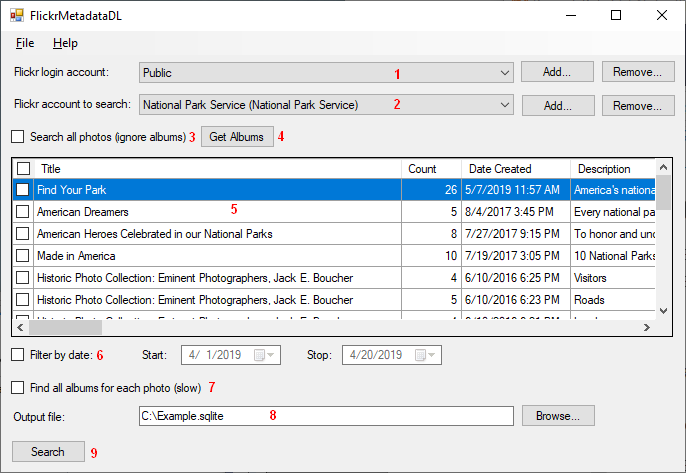
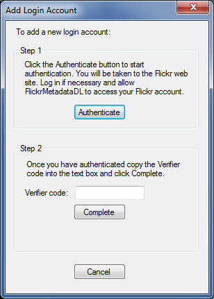

[FlickrMetadataDL](https://github.com/dmcclimans/FlickrMetadataDL)
==========

FlickrMetadataDL is a Windows application that can download the metadata from photos in a
Flickr account and create an SQLite database of metadata and tags.

FlickrMetadataDL was developed for use by the USA National Forest Service to generate databases
from wildlife photos that have been tagged with species identification.

## Contents
* [Features](#features)
* [Requirements](#requirements)
* [Installation](#installation)
* [Usage](#usage)
* [Authentication](#authentication)
* [SQLite Database](#SQLiteDatabase)
* [License](#license)

## Features
* Generate a database of photo metadata from selected albums in an account.
* Generate a database of photo metadata for all photos visible in an account.

## Requirements
* Requires Windows 7 or later.

## Installation
* Go to the FlickrMetadataDL
  [latest release](https://github.com/dmcclimans/FlickrMetadataDL/releases/latest)
  page and download `FlickrMetadataDL_x.y.zip` (where x.y is the version number).

* There is no install program.
  Unzip the files into a folder, and run `FlickrMetadataDL.exe`.

## Usage

1. The **Login account** is the account that you will be logged in as when you perform the
search.
Select **Public** to search without logging in (which will retrieve only photos that are
visible to the public.

    To search as a logged in user, you must add a login account. This will require you to
    authenticate the account. See the [Authentication](#authentication) section below.

2. The **Search account** is the account to search.
You can add any account where you know the account name or email address.

3. Check the **Search all photos** checkbox to search all photos of the search account.

    This works well with accounts that have fewer than 4000 photos. For accounts that have
    more than 4000 photos, you must break the search into smaller pieces using the **Filter
    by date** option, or search by album.

4. Click the **Get Albums** button to retrieve the list of albums for the search account.

5. The **Album list** shows the albums retrieved by the **Get Albums** button. Select
the albums that you wish to process. You can click on the column headers to sort the
albums by name or other property.

6. Use the **Filter by date** option to select a subset of photos that were taken during
the specified date range.

7. Check **Find all albums** to retrieve a list of albums for each photo.

    If you do not check this option, FlickrMetadataDL will only keep track of the albums
    you asked it to search. For example, if the same photo is found in 2 albums that are
    enabled for searching, it will be listed in both albums in the database. But if that
    photo also belongs to a third album that you are not searching, that third album will
    not be listed unless you check this option.

    Check this only when you need it, as this option slows processing dramatically.

8. Specify the path and name of the **Output SQLite database file**.

9. Click the **Search** button to perform the search.

## Authentication

To add a **Login account**, you must "Authenticate" the FlickrMetadataDL application with
that account. This process tells Flickr to allow FlickrMetadataDL to access the account.
You must be logged in to the account to be able to authenticate.

FlickrMetadataDL cannot make any changes to your account, since it requests only 
**read** access to your account.

To authenticate:

1. In your browser, log into the Flickr account that you wish to add as your login
account.

2. In FlickrMetadataDL, click the **Add** button to add a login account.

3. You will see the Add Login Account dialog:

4. Click the Authenticate button.

5. Your browser will open a new window or tab displaying a Flick Page asking you to
authorize FlickrMetadataDL to access your account.

    Click **OK, I'll authorize it** button.

6. Flickr will display another page showing the 9-digit authorization code. Copy and paste
this code into the **Verifier code** text box in FlickrMetadataDL.

7. Click the **Complete** button.

8. Close the Add Login Account dialog.

## SQLite Database

The output SQLite database contains 4 tables:

- **Photos**: A table listing each photo and its metadata.
- **PhotoTags**: A table of tags for each photo.
- **Albums**: A table of albums.
- **PhotoAlbums**: A table of albums for each photo.

The metadata retrieved for each photo includes:
- PhotoID
- Title
- Description
- Date taken
- Date uploaded
- Owner ID
- Latitude and Longitude
- License
- Number of views, comments, and favorites
- URL, height, and width of photos in various sizes

Many database tools can work with SQLite databases.
If you don't have a favorite tool, we recommend
[DBeaver](https://dbeaver.io/), a universal database tool that can view and
manipulate databases in a wide variety of formats, including SQLite.
You can perform searches and other tasks by entering SQL commands.
DBeaver can export to other database formats, and can export to CSV (comma-separated-variable)
files that can be read by Excel.
DBeaver is free and open-source.

## License
FlickrMetadataDL is licensed under the MIT license. You may use the FlickrMetadataDL
application in any way you like. You may copy, distribute and modify the FlickrMetadataDL
software provided you include the copyright notice and license in all copies of the
software.

FlickrMetadataDL links to libraries that are licensed under the Apache license or are
public domain.

See the [License.txt](License.txt) file for additional information.

